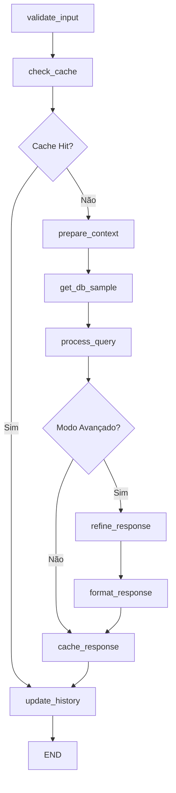

# 🏗️ AgentGraph - Arquitetura Técnica Detalhada

## 🎯 Visão Geral

O AgentGraph é uma **plataforma multi-agente** construída com LangGraph, implementando uma arquitetura modular e extensível baseada em nós especializados. O sistema suporta múltiplos provedores LLM (OpenAI, Anthropic, HuggingFace) com processamento assíncrono, gerenciamento inteligente de objetos não-serializáveis e sistema robusto de retry para rate limiting.

### **Principais Inovações Arquiteturais**
- 🔄 **Fluxo Otimizado**: Detecção → AgentSQL → Refinamento (sem LLM intermediária)
- 🧠 **Multi-Provedor**: Suporte nativo a OpenAI, Anthropic e HuggingFace
- 🛠️ **Tool-Calling**: Ferramentas SQL nativas with verbose ativo
- 🎛️ **Object Manager**: Solução elegante para objetos não-serializáveis
- ⚡ **Async/Await**: Processamento não-bloqueante em toda a stack
- 🔍 **LangSmith Integration**: Observabilidade completa com rastreamento automático

## 📁 Estrutura do Projeto

```
agentgraph/
├── app.py                     # Entry point: Gradio + LangGraph
├── graphs/
│   └── main_graph.py          # StateGraph principal
├── nodes/                     # Nós especializados
│   ├── csv_processing_node.py # Processamento genérico de CSV
│   ├── database_node.py       # Operações de banco de dados
│   ├── query_node.py          # Processamento de consultas
│   ├── refinement_node.py     # Refinamento de respostas
│   ├── cache_node.py          # Gerenciamento de cache
│   ├── agent_node.py          # Coordenação geral
│   └── custom_nodes.py        # Nós especializados
├── agents/
│   ├── sql_agent.py           # Criação do agente SQL
│   └── tools.py               # Ferramentas do agente
├── utils/
│   ├── database.py            # Funções de banco de dados
│   ├── config.py              # Configurações
│   └── object_manager.py      # Gerenciador de objetos não-serializáveis
├── uploaded_data/             # Arquivos CSV enviados
├── requirements.txt
├── README.md
├── ARCHITECTURE.md
└── .env
```

## 🔄 Fluxo do LangGraph

### Fluxo Principal de Consulta



### Nós Especializados

#### 1. **csv_processing_node.py**
- **Função**: Processamento genérico de CSV
- **Características**:
  - Detecção automática de separadores (`;`, `,`, `\t`, `|`)
  - Identificação inteligente de tipos de dados
  - Conversão robusta para SQL types
  - Estatísticas de processamento

#### 2. **database_node.py**
- **Função**: Operações de banco de dados
- **Características**:
  - Criação de banco a partir de DataFrame processado
  - Carregamento de banco existente
  - Obtenção de amostras de dados
  - Validação de integridade

#### 3. **query_node.py**
- **Função**: Processamento de consultas SQL
- **Características**:
  - Validação de entrada
  - Preparação de contexto
  - Execução via agente SQL
  - Tratamento de erros

#### 4. **refinement_node.py**
- **Função**: Refinamento de respostas
- **Características**:
  - Modo avançado com LLM adicional
  - Avaliação de qualidade
  - Formatação final
  - Adição de insights

#### 5. **cache_node.py**
- **Função**: Gerenciamento de cache e histórico
- **Características**:
  - Verificação de cache
  - Armazenamento de respostas
  - Atualização de histórico
  - Estatísticas de uso

## 🔍 Integração LangSmith

### **Observabilidade Automática**
O AgentGraph inclui integração completa com LangSmith para rastreamento e monitoramento:

```python
# Configuração automática via variáveis de ambiente
LANGSMITH_TRACING=true
LANGSMITH_API_KEY=lsv2_pt_...
LANGSMITH_PROJECT=agentgraph-project

# Rastreamento automático de todo o fluxo LangGraph
workflow.invoke(state) # ← Automaticamente rastreado
```

### **Componentes Rastreados**
- ✅ **Todos os nós LangGraph**: validate_input → process_query → cache_response
- ✅ **Agentes SQL**: Chamadas LLM com inputs/outputs completos
- ✅ **Modelos Multi-Provedor**: OpenAI, Anthropic, HuggingFace
- ✅ **Operações de Dados**: CSV processing, database operations
- ✅ **Geração de Gráficos**: Seleção e criação de visualizações

### **Benefícios da Integração**
- 🔍 **Debug Avançado**: Visualize fluxo completo de execução
- 📊 **Métricas de Performance**: Latência por nó e operação
- 💰 **Análise de Custos**: Uso de tokens por modelo
- 🐛 **Troubleshooting**: Identifique gargalos e erros
- 📈 **Dashboards**: Monitoramento em tempo real

## 🧠 Gerenciador de Objetos

### Problema Resolvido
O LangGraph requer que o estado seja serializável, mas objetos como SQLAgentManager, Engine e CacheManager não são serializáveis.

### Solução: ObjectManager
```python
# Armazena objetos não-serializáveis
agent_id = object_manager.store_sql_agent(sql_agent)
engine_id = object_manager.store_engine(engine)
cache_id = object_manager.store_cache_manager(cache_manager)

# Estado serializável
state = {
    "user_input": "query",
    "agent_id": agent_id,
    "engine_id": engine_id,
    "cache_id": cache_id
}

# Recupera objetos quando necessário
sql_agent = object_manager.get_sql_agent(agent_id)
```

## 📊 Processamento CSV Genérico

### Detecção Automática de Tipos

```python
# Detecta automaticamente:
- Datas: Tenta conversão com pd.to_datetime()
- Números inteiros: Verifica padrões numéricos
- Números decimais: Detecta pontos/vírgulas
- Texto: Mantém como string

# Regras de processamento:
- parse_dates: Para colunas de data
- convert_to_int: Para números inteiros
- convert_to_float: Para números decimais
- convert_text_to_int/float: Para texto numérico
- keep_as_text: Para texto puro
```

### Separadores Suportados
- `;` (ponto e vírgula)
- `,` (vírgula)
- `\t` (tab)
- `|` (pipe)

## 🔧 Configurações

### Arquivo .env
```env
# API Keys
HUGGINGFACE_API_KEY=your_key_here
OPENAI_API_KEY=your_key_here
ANTHROPIC_API_KEY=your_key_here

# LangSmith - Observabilidade (OPCIONAL)
LANGSMITH_API_KEY=lsv2_pt_your_key_here
LANGSMITH_TRACING=true
LANGSMITH_ENDPOINT=https://api.smith.langchain.com
LANGSMITH_PROJECT=agentgraph-project

# Database Configuration
SQL_DB_PATH=data.db
DEFAULT_CSV_PATH=tabela.csv
UPLOAD_DIR=uploaded_data

# Model Configuration
DEFAULT_MODEL=GPT-4o-mini
MAX_ITERATIONS=40
TEMPERATURE=0

# Gradio Configuration
GRADIO_SHARE=False
GRADIO_PORT=7860
```

## 🚀 Funcionalidades

### ✅ Mantidas do Código Original
- Múltiplos modelos LLM (LLaMA 70B, 8B, Qwen 32B)
- Upload de CSV personalizado
- Sistema de cache inteligente
- Modo avançado com refinamento
- Histórico de conversas
- Interface Gradio moderna
- Reset do sistema

### ✅ Novas Funcionalidades
- Processamento genérico de CSV
- Arquitetura modular de nós
- Gerenciamento de objetos não-serializáveis
- Fluxo condicional otimizado
- Validação automática de sistema
- Detecção automática de portas
- Logs estruturados
- **Integração LangSmith**: Observabilidade completa e automática

## 🧪 Testes

### Arquivo de Teste
```bash
python test_new_architecture.py
```

Testa individualmente:
- Processamento CSV
- Criação de banco
- Agente SQL
- Gerenciador de objetos
- Amostra de dados

## 🔄 Deploy

### Local
```bash
python app.py
```

### HuggingFace Spaces
1. Configure as variáveis de ambiente
2. Faça upload dos arquivos
3. O sistema detectará automaticamente a porta disponível

## 📈 Benefícios da Nova Arquitetura

1. **Escalabilidade**: Fácil adição de novos nós
2. **Manutenibilidade**: Código organizado e modular
3. **Robustez**: Sem problemas de serialização
4. **Flexibilidade**: Processamento genérico de dados
5. **Performance**: Fluxo otimizado com cache
6. **Debugging**: Logs detalhados por nó
7. **Testabilidade**: Nós independentes testáveis

## 🔍 Monitoramento

### Logs Estruturados
```
[VALIDATION] - Validação de entrada
[CACHE] - Operações de cache
[CONTEXT] - Preparação de contexto
[DATABASE] - Operações de banco
[QUERY] - Processamento de consultas
[REFINE] - Refinamento de respostas
[HISTORY] - Atualização de histórico
```

### Estatísticas
- Tempo de execução por nó
- Taxa de acerto do cache
- Estatísticas de processamento CSV
- Validação de componentes

## 🚀 Roadmap de Expansão

### **🎯 Arquitetura Preparada para Múltiplos Agentes**

A arquitetura atual está **perfeitamente preparada** para expansão com novos agentes especializados:

#### **📄 Agente PDF (Curto Prazo)**
```python
# Implementação planejada:
nodes/pdf_processing_node.py
agents/pdf_agent.py

# Funcionalidades:
- Extração de texto (PyPDF2, pdfplumber)
- OCR para documentos escaneados (Tesseract)
- Análise de estrutura de documentos
- Busca semântica em conteúdo
- Integração com LangGraph existente
```

#### **🗄️ Agente MySQL (Médio Prazo)**
```python
# Implementação planejada:
nodes/mysql_node.py
agents/mysql_agent.py

# Funcionalidades:
- Conexões externas MySQL/PostgreSQL
- Pool de conexões otimizado
- Queries complexas com JOINs
- Transações e rollbacks
- Múltiplas bases de dados
```

#### **📊 Agente de Gráficos (Médio Prazo)**
```python
# Implementação planejada:
nodes/chart_generation_node.py
agents/chart_agent.py

# Funcionalidades:
- Matplotlib, Plotly, Seaborn
- Gráficos baseados em consultas SQL
- Análise automática de dados
- Exportação em múltiplos formatos
- Dashboards interativos
```

#### **🤖 Agente de ML/Previsões (Longo Prazo)**
```python
# Implementação planejada:
nodes/prediction_node.py
agents/ml_agent.py

# Funcionalidades:
- Modelos de Machine Learning
- Análise de séries temporais
- Previsões automáticas
- Integração com scikit-learn
- AutoML capabilities
```

### **🔄 Sistema de Detecção Expandido**

```python
def detect_query_type(user_query: str) -> str:
    """Função já preparada para expansão"""

    query_lower = user_query.lower().strip()

    # Detecção atual
    if 'sql' in query_lower or 'tabela' in query_lower:
        return 'sql_query'

    # Expansões futuras (já estruturadas)
    elif 'pdf' in query_lower or 'documento' in query_lower:
        return 'pdf_processing'
    elif 'mysql' in query_lower or 'banco mysql' in query_lower:
        return 'mysql_query'
    elif 'gráfico' in query_lower or 'chart' in query_lower:
        return 'chart_generation'
    elif 'prever' in query_lower or 'previsão' in query_lower:
        return 'prediction'

    return 'sql_query'  # Default
```

### **🎛️ Roteamento Condicional Preparado**

```python
# No main_graph.py - Estrutura já preparada
def route_by_type(state: Dict[str, Any]) -> str:
    query_type = state.get("query_type", "sql_query")

    routing_map = {
        "sql_query": "sql_processing",
        "pdf_processing": "pdf_processing",      # FUTURO
        "mysql_query": "mysql_processing",       # FUTURO
        "chart_generation": "chart_generation",  # FUTURO
        "prediction": "prediction_processing"    # FUTURO
    }

    return routing_map.get(query_type, "sql_processing")
```

### **📈 Facilidade de Implementação**

**Por que é fácil expandir:**
- ✅ **Estrutura modular** - Cada agente = novo nó
- ✅ **ObjectManager flexível** - Gerencia qualquer objeto
- ✅ **Sistema de detecção** - Já preparado para novos tipos
- ✅ **Configurações centralizadas** - Fácil adicionar APIs
- ✅ **Interface dinâmica** - Dropdown automático
- ✅ **Async/await** - Performance mantida
- ✅ **Logs estruturados** - Debugging facilitado

### **🎯 Próximos Passos Recomendados**

1. **Agente PDF** - Implementação mais simples e útil
2. **Sistema de Templates** - Prompts especializados por agente
3. **Métricas avançadas** - Performance por tipo de agente
4. **API REST** - Exposição de funcionalidades
5. **Agente MySQL** - Conexões externas
6. **Sistema de Pipelines** - Combinação de agentes

---

**🏆 Conclusão**: A arquitetura atual é **excepcional** e está perfeitamente preparada para se tornar uma **plataforma completa de agentes especializados**. A expansão será natural e incremental, mantendo a robustez e performance existentes.
